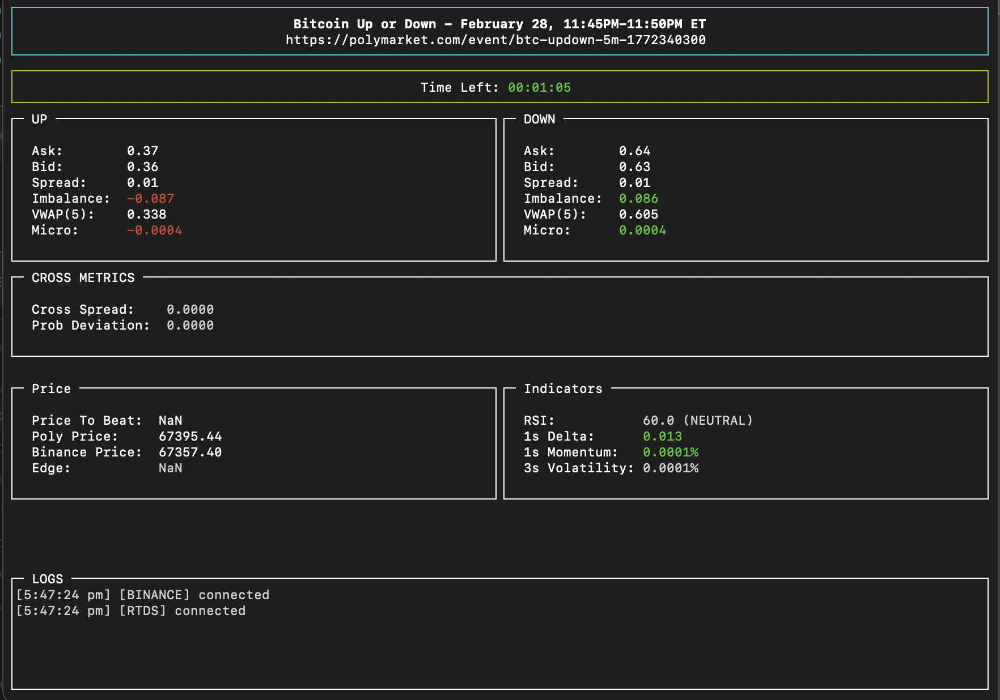

# PolyDepth



A real-time analytics and research bot for Polymarket short-term crypto **Up/Down** markets.

PolyDepth connects to:

- Polymarket CLOB (order book)
- Polymarket RTDS (Chainlink price feed)
- Binance aggregated trades
- Historical order book snapshots (for research & backtesting)

It computes structured market metrics such as spread, imbalance, VWAP, microprice shift, RSI, momentum, volatility, and cross-market deviations to identify short-term inefficiencies.

> ⚠️ This project is for research and educational purposes only. It is not financial advice.

---

## ✨ Features

### 1️⃣ Real-Time Order Book Analytics (Polymarket)

For both **UP** and **DOWN** tokens:

- Best bid / ask
- Mid price
- Spread
- Order book imbalance
- Top-N VWAP
- Microprice & micro shift
- Depth within configurable percentage ranges

Cross-metrics:

- Cross spread (`Up ask + Down bid - 1`)
- Probability deviation (`Up mid - (1 - Down mid)`)

---

### 2️⃣ Binance Real-Time Indicators

Using: `wss://fstream.binance.com/ws/btcusdt@aggTrade`
Calculated indicators:

- 1-second delta
- Short-term momentum
- Rolling volatility
- RSI (configurable period)
- Recent trade activity window

#### Price to Beat Logic and limition

The "Price to Beat" is intended to represent the underlying reference price at the start of each market interval.

Ideally, this value would be retrieved from a historical Chainlink price API at the exact event start timestamp. However, Chainlink does not provide a simple public API for querying historical price data at arbitrary timestamps.

To work around this limitation, PolyDepth uses the following approach:

- At the end of each event interval, the final observed Chainlink price is stored.
- This stored value is then used as the **"Price to Beat"** for the next event interval.
- This creates a rolling reference price mechanism between consecutive markets.

For the very first event after the application starts:

- There is no previously recorded end price.
- Therefore, no "Price to Beat" value is available.
- Any derived metrics that depend on the "Price to Beat" will be undefined for that initial event.

Once the first event completes, subsequent events will have a valid reference price.

This approach ensures consistent price anchoring across intervals without requiring historical oracle queries.

---

### 3️⃣ Chainlink Price Anchor (Polymarket RTDS)

- Real-time underlying reference price
- "Price to beat" tracking
- Event end anchor capture

---

### 4️⃣ Snapshot Recorder

Optional structured state recording:

- Timestamped snapshots
- Order book metrics
- Cross metrics
- Binance indicators
- Reference prices

Snapshots are written in JSONL format for later analysis and backtesting.

---

## 🚀 Run

### Supported Runtime Environments

PolyDepth is built with:

- **Node.js 18+**

- **Yarn 4 (Berry)**

It can run in the following environments:

### Run in dev mode

```
yarn dev
```

### Run in production build

```
yarn build && yarn start
```

### Run in packed execution file (not tested)

```
npx pkg .
```

generates two execution file for win and Mac, but not tested.

## ⚙️ Configuration

By default, PolyDepth is configured to monitor the **BTC 5-minute Up/Down market**.
You can modify the market and runtime behavior by editing: `src/settings.ts`

### Configuration options

```
type:  "btc", -> Supported values: "btc", "eth", "xrp", "sol"
interval:  5, -> Market duration in minutes (e.g., 5, 15)
recordSnapshots:  false, -> change to true will record snaptshots ()
```

then stop and app and run again.

---

# PolyDepth 中文说明

PolyDepth 是一个用于 Polymarket 短周期加密货币 **Up/Down 市场** 的实时分析与研究工具。

PolyDepth 连接以下数据源：

- Polymarket CLOB（订单簿）
- Polymarket RTDS（Chainlink 价格源）
- Binance 成交数据流
- 历史订单簿快照（用于研究与回测）

系统会计算结构化市场指标，例如：

- 买卖价差（Spread）
- 订单簿不平衡（Imbalance）
- VWAP
- 微观价格偏移（Microprice Shift）
- RSI
- 动量（Momentum）
- 波动率（Volatility）
- 跨市场偏差（Cross-market deviation）

用于识别短期价格异常或结构性失衡。

> ⚠️ 本项目仅用于研究和学习目的，不构成任何投资建议。

---

## ✨ 功能说明

### 1️⃣ Polymarket 实时订单簿分析

针对 **UP** 与 **DOWN** 两个方向：

- 最优买价 / 卖价
- 中间价（Mid Price）
- 价差（Spread）
- 订单簿不平衡指标
- Top-N VWAP
- 微观价格与偏移
- 指定范围内的深度统计

跨市场指标：

- Cross Spread (`Up ask + Down bid - 1`)
- 概率偏差 (`Up mid - (1 - Down mid)`)

---

### 2️⃣ Binance 实时技术指标

使用 Binance Futures 实时流：`wss://fstream.binance.com/ws/btcusdt@aggTrade`
计算指标包括：

- 1秒价格变化（Delta）
- 短期动量（Momentum）
- 滚动波动率（Volatility）
- RSI（可配置周期）
- 最近成交活跃度

---

### 3️⃣ Chainlink 价格锚定

- 实时标的价格
- “Price to beat” 追踪
- 事件结束价格记录

---

#### Price to Beat 逻辑与限制说明

“Price to Beat” 用于表示每个市场周期开始时的底层参考价格。

理想情况下，这个值应当通过查询 Chainlink 在事件开始时间点的历史价格获得。然而，目前 Chainlink 并未提供一个简单的公开 API 来按任意时间戳查询历史价格数据。

为了解决这一限制，PolyDepth 采用了以下方法：
• 在每个市场周期结束时，记录当时最后观测到的 Chainlink 价格；
• 将该价格作为下一周期的 “Price to Beat”；
• 通过这种方式，在相邻市场之间形成一个滚动的参考价格机制。

对于应用程序启动后的第一个市场周期：
• 由于此前没有记录过结束价格；
• 因此不会存在可用的 “Price to Beat”；
• 所有依赖 “Price to Beat” 计算的衍生指标，在该首个周期内都会是未定义状态。

当第一个周期结束后，后续周期将拥有有效的参考价格。

这种方法可以在无需查询历史预言机数据的前提下，实现市场周期之间的一致价格锚定。

### 4️⃣ 快照记录系统

支持可选快照记录：

- 时间戳
- 订单簿指标
- 跨市场指标
- Binance 技术指标
- 参考价格

快照格式为 JSONL，便于后续回测与数据分析。

---

## 🚀 运行环境

### 支持环境

PolyDepth 基于：

- **Node.js 18+**
- **Yarn 4 (Berry)**

支持运行环境：

- macOS
- Windows
- Linux（理论支持）

---

### 开发模式运行

```
yarn dev
```

### 生产模式运行

```
yarn build && yarn start
```

### 打包执行文件（未充分测试）

```
npx pkg .
```

会生成：

- Windows 可执行文件

- macOS 可执行文件

⚠️ 打包功能尚未充分测试，建议优先使用 Node 运行。

---

## ⚙️ 配置说明

默认监控市场为：

**BTC 5分钟 Up/Down 市场**

如需修改，请编辑：`src/settings.ts`

### 可配置选项

```
type:  “btc”  // 可选：btc, eth, xrp, sol

interval:  5  // 市场周期（分钟），例如 5 或 15

recordSnapshots: false  // 是否开启快照记录
```

修改完成后，请停止程序并重新运行。

---

## ⚠️ 风险提示

- 本工具仅用于市场结构研究
- 不保证盈利
- 不构成投资建议
- 加密市场波动极大，请谨慎操作

---

欢迎研究交流与反馈。
